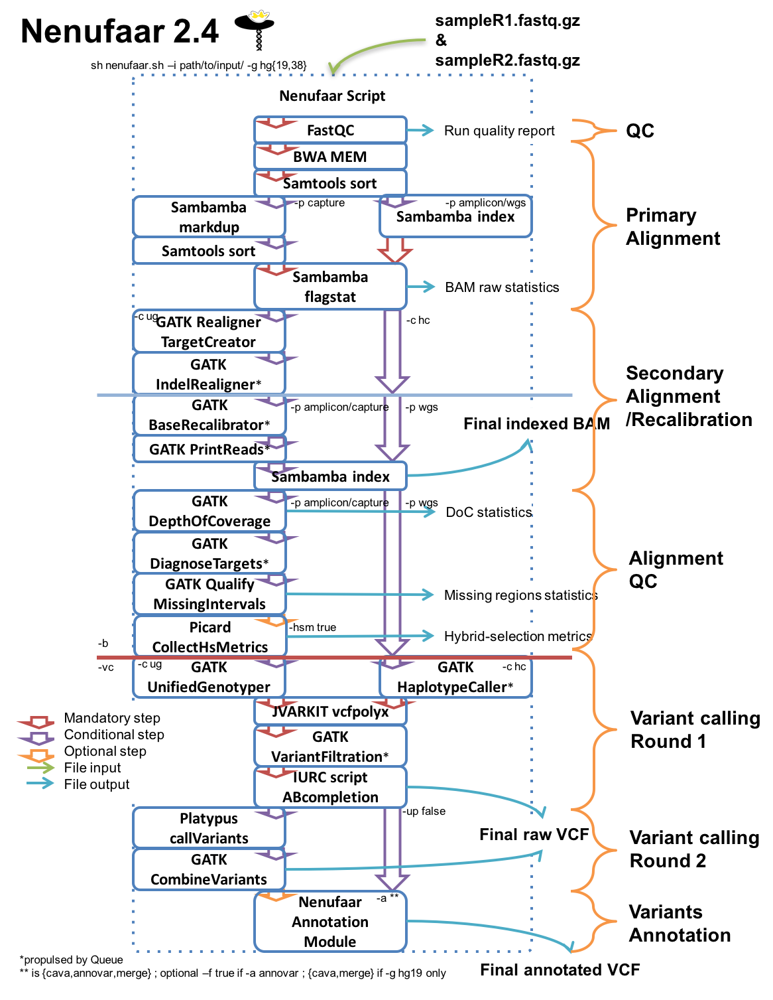
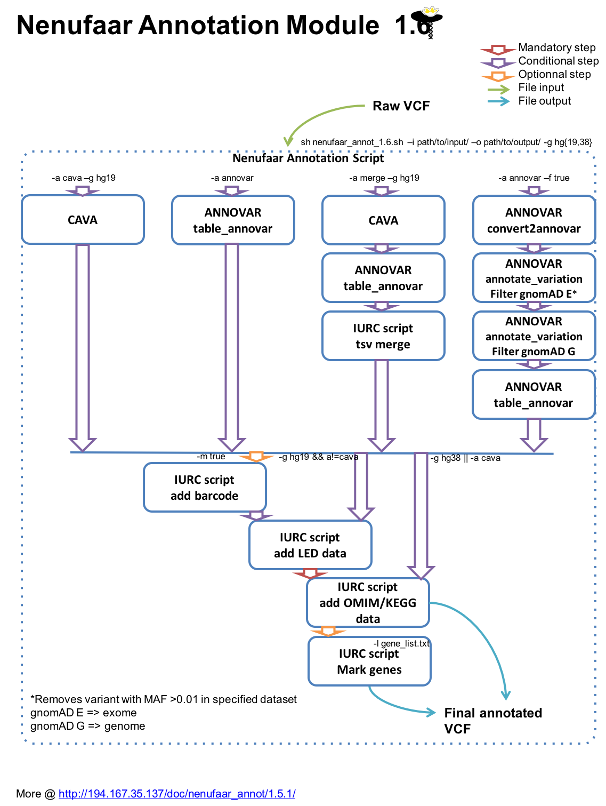
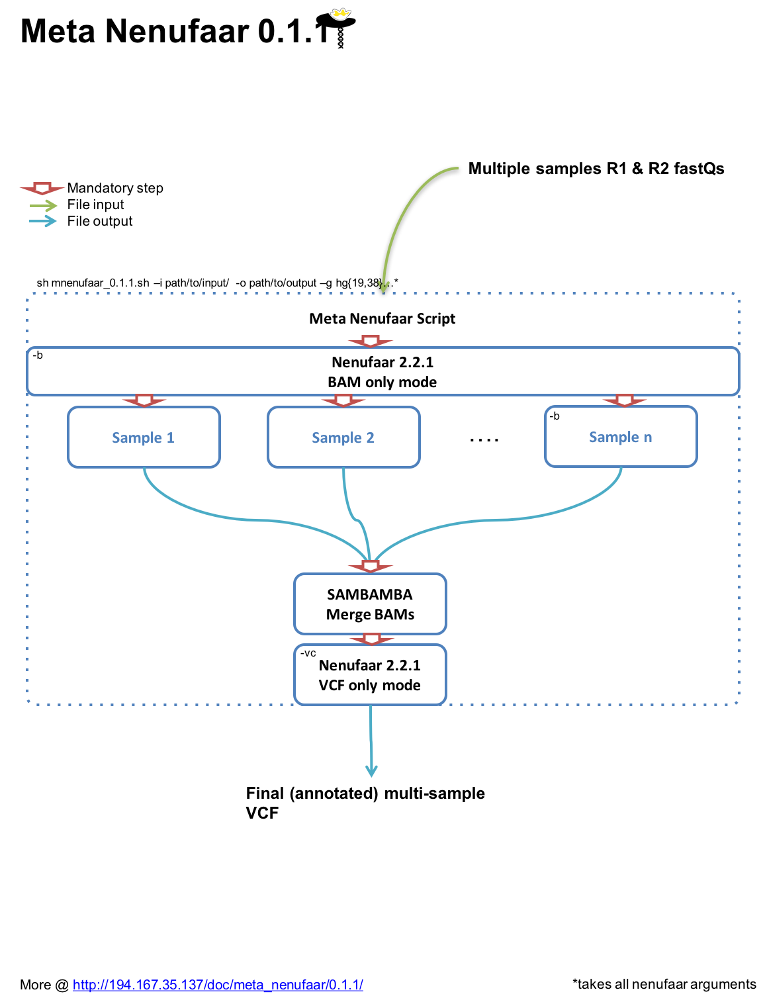

# Nenufaar v2.4

DNA NGS pipeline

- [Goals](#goals)
- [Install & Config](#install--config)
- [Warning](#warning)
- [Architecture](#architecture)
- [Arguments](#arguments)
- [Options](#options)
- [Tests](#tests)
- [Workflow](#workflow)
- [Operation](#operation)
- [Docs](#docs)

## Goals


Perform a full analysis of a NGS run form the sequences (fastQ files) to the variants annotation.


Main steps are:


*	Quality control of raw data (FastQC)
*	Alignment (BWA-samtools)
*	Indels realignment (GATK, optional)
*	Variant calling and filtration (GATK, jvarkit, home made perl script)
*	2nd variant calling step (Platypus) and merging (GATK)
*	Annotation (via nenufaar_annot.sh)

Nenufaar comes with two companion scripts:

*	nenufaar_annot which performs the annotation of the VCFs generated with nenufaar and can be an as a standalone

*	mnenufaar (for meta-nenufaar) which is a kind of family mode in the sense that it will generate BAMs, merge them and perform the calling on this single BAM. The final resulting annotated tsv e.g. from ANNOVAR will contain an extra column 'barcode' which indicates who in the family is heterozygous/homozygous, etc for the considered variant. Options are the same than for nenufaar.

## Install & Config


TODO


## Warning

Nenufaar extensively uses GATK 3.8, therefore is currently limited to academic users or users with a proper GATK license

## Architecture


It is a shell script named nenufaar.sh which can analyse several samples successively. The structure of the input folder should look like this:


	<my run folder>
		|
		<Intervals.list>
		|
		|
		<sample_1>
		|   	|
		|   	|
		|   	<sample_1.R1.fastq.gz>
		|   	|
		|   	<sample_1.R2.fastq.gz>
		|   	|
		|
		<sample_2>
		|   	|
		|   	|
		|   	<sample_2.R1.fastq.gz>
		|   	|
		|   	<sample_2.R2.fastq.gz>
		|
		|
		<etc> ....


Interval list file is mandatory in this version and must be named Intervals.list and must be located at the root of the run folder.

Format:
*	chr:start-stop

Example:
*	chr1:124522-124985

The fastQ files must be named as above, e.g. SU2332.R1.fastq.gz

## Arguments

*	-i,  --input_path    sets the absolute path to input directory (must be created before script execution) => above

## Options


*	-h,  --help	Shows this help text

*	-dcov, --downsample_to_coverage	GATK option default 1000 - selects the variant caller, HaplotypeCaller if dcov <= 1000, or UnifiedGenotyper - DEPRECATED IN THIS VERSION

*	-a, --annotator	Name of annotator: cava (output to textfile), annovar (output to both text and vcf file), vep and snpeff (both output to VCF), default no annotation

*	-f, --filter	Combined with annovar only, filters out variants with MAF > 1% in ExAC, ESP or 1KG, true/false, default false. Warning: does not produce the annotated VCF, only tab delimited file.

*	-g, --genome	Version of genome (assembly), either hg19 or hg38, default hg19

*	-c, --caller	Chooses which variant caller to use: ug: UnifiedGenotyper or hc, HaplotypeCaller default hc

*	-up, --use_platypus	Platypus variant calling - Default behaviour is GATK variant calling, then Platypus and VCF merging using GATK CombineVariants, true/false, default true

*	-hsm, --hsmetrics	Boolean true,false: Asks for Picard CollectHsMetrics calculation: necessitates a Picard.intervals.list (target picard file) file at the root of the run folder, default false - can also take a baits interval file named Picard.baits.intervals.list

*	-p, --protocol	Protocol used to select sequences: capture/amplicon/wgs, default capture 

*	-b, --bam_only	Only generates BAM files

*	-vc --variant_calling_only	Processes variant calling from a single BAM

*	-id, --processus_id	defines a non-random processus id

*	-o,  --output_path	Sets the absolute path to output directory (must be created before script execution)

*	-r,  --reference	Path to genome fasta reference file

*	-snp, --snp	Sets the absolute path to vcf file for dbSNP

*	-indel1, --indel1	Sets the absolute path to vcf file for indels reference (1000G_phase1.indels sor Mills_and_1000G_gold_standard)

*	-indel2, --indel2	Set sthe absolute path to vcf file for indels reference (1000G_phase1.indels or Mills_and_1000G_gold_standard)

*	-l, --gene_list	Path to a txt file with a #NAME and a list of genes to be marked in a annovar file

*	-cu, --clean_up	Boolean true, false: set to false to keep intermediate files (for dev purpose)

*	-log, --log-file	Path to log file

*	-cf, --config-file	Provide a config file path, e.g. for containers

## Tests

To test a new version, please ensure that the different workflow still run without errors. Current tests involve:

### nenufaar itself:

```bash

nohup sh tests/nenufaar_test.sh -v version_number &

```

will launch:

*	-p wgs		// test whole genome workflow (no dupmark, no GATK BR&PR, no GATK DoC&QMI, caller GATK HC)

*	-p capture	// test capture workflow (dupmark, GATK BR&PR , caller GATK HC), includes annotation

*	-p amplicon	// test amplicon workflow (no dupmark, GATK RTC&IR , caller GATK UG)

### To test mnenufaar, launch:

```bash

nohup sh tests/mnenufaar_test.sh -v version_number &

```

### To test the annotation module, launch:

```bash

nohup sh tests/nenufaar_annot_test.sh -v version_number &

```

will launch:

*		hg19 ANNOVAR

*		hg38 ANNOVAR

*		hg19 filtered ANNOVAR

*		hg19 merged (CAVA+ANNOVAR)

**You must have files in input/testsMinifastq_vcf/ (vcf), input/testsMinifastqTest/, input/testsMinifastqTest_m/ (fastqs + Intervals.list + Picard.intervals.list files)**

Results can be found in tests/logs/nenufaar(or mnenufaar or nenufaar_annot)/version_number/SUMMARY.log

## Workflow

### nenufaar:



### nenufaar_annot:



### metanenufaar (mnenufaar):



## Operation


The idea is to modifiy the behaviour of the script for example depending on downsampling conditions.

Downsampling typically is a gain of computer time for most applications that are not well calibrated - too much reads at a given site. But there are some cases where you want many many reads at a given site - even for your whole experiment. In our lab typically this can be applied to NIPD.

The issue at the time is that GATK's variant caller HaplotypeCaller, used by the pipeline for regular runs, cannot deal with downsampling options (-dcov in GATK) and uses a default of 500. In addition, the indel realignment tool uses downsampling (default 1000).

In addition, this version can perform alignment only (-b) or variant calling only (-vc). See meta_nenufaar for more information.

Then, the script uses an option -dcov (default 1000) which precises downsampling and behaviour:

*	if -dcov is not provided or if -dcov<=1000; then the selected variant caller is HaplotypeCaller. Indel realignment uses 1000 or provided -dcov.

*	else the selected variant caller is UnifiedGenotyper with -dcov as provided by the user. Indel realignement workflow uses provided -dcov

Depending on the variant caller chosen, the variant filtration which is the next step will be slightly modified.

Platypus is then used as a second variant caller, then VCFs are merged

A second option -a will make the script use either CAVA or ANNOVAR as annotator (default NULL)

-p or --protocol option will ask for marking duplicates via sambamba (capture) or not (amplicons, wgs)

All configuration variables are stored in a separate nenufaar.conf file


## Detailed steps


*	Fastqc :  Quality Control - FatsQC generates a web report on raw data, and establishes the overall quality of the sample in terms of sequence quality, read lengths, per base content...

*	BWA Alignment: MEM to get a single SAM file from the 2 fastq

*	Samtools: BAM sorting

*	Sambamba: Ouputing FlagStat - simple statistics on the BAM file (in file
sample_stats.txt)

Depending on -p, the script will run:

*	EITHER Sambamba if -p=capture: markdup & index

*	OR only Sambamba if -p=amplicon/wgs: index

*	if caller is unified genotyper (-c=ug), GATK : RealignerTargetCreator - creation of an interval file that will contain a list of suspect regions with regard to indels. Subject to downsampling (default 1000 modified with -dcov). Intervals are inside the intervals given as input for the run (typically the captured regions). This means that RealignerTargetCreator only looks at regions of interest.

*	if caller is unified genotyper (-c=ug), GATK : IndelRealigner - Uses Queue the produced special suspect indels interval file by the RealignerTargetCreator is then used as input at this step, together with the BAM file. With this, the IndelRealigner tool examines and realigns the supsect regions around the indels and produces a realigned BAM file

*	GATK : BaseRecalibrator & PrintReads if -p=amplicon/capture - Uses Queue - another two step analysis which produces a per base calibration table given a list of known variants (here dbSNP) (BaseRecalibrator); this table together with the BAM is used by PrintReads in --BQSR mode (Input covariates table file for on-the-fly base quality score recalibration) to produce a sorted clean BAM file.

*	Sambamba : Re-Index - the last BAM file is indexed (production of .bai file) for further analyses

*	GATK : DepthOfCoverage  if -p=amplicon/capture - Uses Queue - generates several files concerning DoC (currently in r table format). Of interest the sample_interval_summary file which contains a list of the intervals together with the mean coverage for each. Can be used to look for large rearrangements

*	GATK : DiagnoseTargets & QualifyMissingIntervals if -p=amplicon/capture - Uses Queue to get info on poorly covered regions

Depending on -hsm, the script will run:

*	Picard CollectHSMetrics or will go to the next step. **if -b, the script stops here.**

*	**if -vc, the script begins here and looks for a file name MERGED_SAMPLES/MERGED_SAMPLES.bam in output folder**

Depending on -dcov, the script will run either:

*	EITHER GATK : UnifiedGenotyper if -dcov > 1000. Kind of deprecated but supports downsampling. Still used in MSR2.5.1.

*	OR GATK : HaplotypeCaller - Now uses Queue - 'modern' method but downsampled default to 500 with no modification possibility.

*	JVARKIT: vcf_polyx which reports a POLYX= annotation in the VCF INFO field

*	GATK : VariantFiltration - Now uses Queue

*	Follows a home made perl script which completes AB annotation for indels and homozygous variants (vcf_allele_balance.pl). Produces the final VCF file before functionnal annotations.

*	PLATYPUS is used as a second caller unless -np or --noplatypus. Then VCFs obtained from GATK caller and Platypus are merged using GATK CombineVariants

Depending on -a (default, no annotation), the vcf is annotated with:

*	CAVA, Clinical Annotation of Variants, a simple and fast way to get the correct hgvs nomenclature for the variants, as well as some useful flags.

*	ANNOVAR, at the time a table_annovar.pl analysis, with 1000g, ESP, ExAC, Kaviar, predictors... Possibility to specify a -f=true option that will pre-filter against 1kG, Kaviar, ExaAC0.3 and ESP6500

*	ANNOVAR and CAVA annotations can be merged on a single tsv file

*	Annotation step is performed via IURC_VCF_ANNOT_version.sh


## Docs


*	[BWA](http://bio-bwa.sourceforge.net/bwa.shtml)
*	[samtools](http://www.htslib.org/doc/samtools-1.2.html)
*	[Picard](http://broadinstitute.github.io/picard/command-line-overview.html)
*	[GATK](https://www.broadinstitute.org/gatk/guide/best-practices?bpm=DNAseq)
*	[GATK downsampling](https://www.broadinstitute.org/gatk/guide/tooldocs/org_broadinstitute_gatk_engine_CommandLineGATK.php#--downsample_to_coverage)
*	[CAVA](http://www.well.ox.ac.uk/cava)
*	[ANNOVAR](http://annovar.openbioinformatics.org/en/latest/)
*	[JVARKIT](https://github.com/lindenb/jvarkit)
*	[SAMBAMBA](http://lomereiter.github.io/sambamba/docs/sambamba-view.html)
*	[PLATYPUS](http://www.well.ox.ac.uk/platypus)


--------------------------------------------------------------------------------

**Montpellier Bioinformatique pour le Diagnostique Clinique (MoBiDiC)**

*CHU de Montpellier*

France


--------------------------------------------------------------------------------
